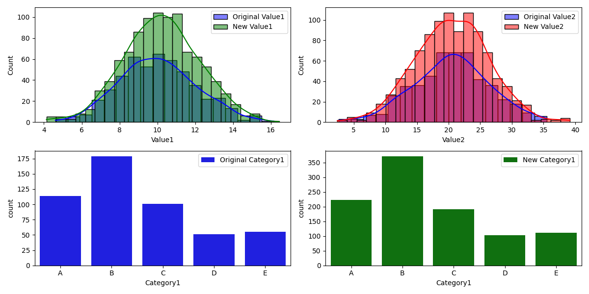
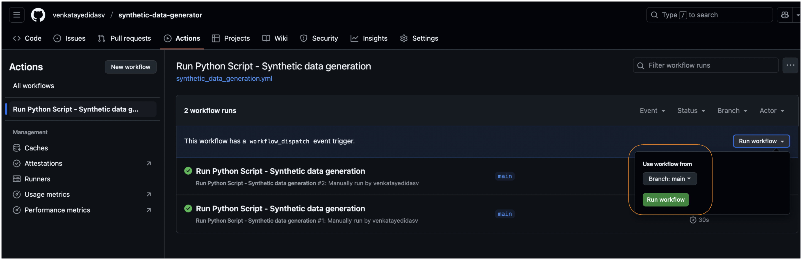

#  Synthetic Dataset Generation & Verification

This project is part of a PhD selection task at BTH. It involves generating a synthetic dataset that mimics the characteristics of an original dataset without reusing its sampling parameters.

---

## 1. **Original Dataset Generation**
The original dataset includes:
- A categorical variable `Category1` with values A–E.
- Two continuous variables:
  - `Value1` ~ Normal(10, 2)
  - `Value2` ~ Normal(20, 6)

## 2. **New Dataset Generation**
Instead of hard coding the original parameters, I:
- **Extracted empirical distributions** from the original dataset.
- Used these to **sample 1000 new rows**.
- Ensured the new dataset reflects the same statistical properties.

## 3. **Verification**
To verify similarity between the original and new datasets, we used both statistical and visual methods:

### Statistical Verification
- Statistical summaries showed that the means and standard deviations of Value1 and Value2 in the new dataset closely match those of the original dataset.
- Category1 proportions were also preserved, with only minor variations due to sampling.

### Visual Verification
- Histograms and count plots were generated to visually compare the distributions of `Value1`, `Value2`, and `Category1` between the original and new datasets.
- Histograms for Value1 and Value2 showed nearly identical distributions.
- Count plots for Category1 (ordered A–E) revealed consistent category frequencies.

*These results indicate that the new dataset successfully replicates the structure and distribution of the original, while being generated from derived characteristics rather than reused parameters.*

---

## 📁 Files and Execution

### Files

- `dataset.csv`: Original dataset (500 samples)
- `new_dataset.csv`: New dataset (1000 samples)
- `comparison.png`: Visual comparison of distributions
- `main.py`: Full code for generation and verification

### Execution

To run the synthetic data generation code (generate_data.py) from .github/workflows/synthetic_data_generation.yml 

---

